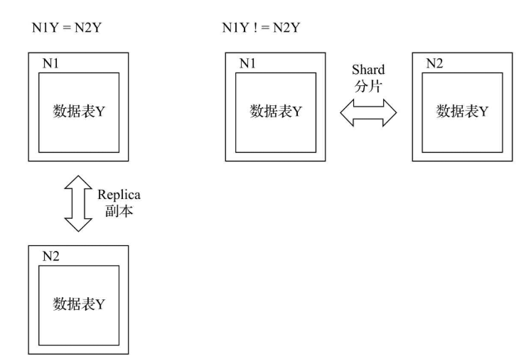

# clickhouse

## 安装

### docker

```bash
mkdir -p /Users/ak47/Documents/docker/clickhouse/data
mkdir -p /Users/ak47/Documents/docker/clickhouse/conf
mkdir -p /Users/ak47/Documents/docker/clickhouse/log

#chmod -R 777 /Users/ak47/Documents/docker/clickhouse/data
#chmod -R 777 /Users/ak47/Documents/docker/clickhouse/conf
#chmod -R 777 /Users/ak47/Documents/docker/clickhouse/log
# 拉取镜像
docker pull yandex/clickhouse-server:20.6.3.28
# docker ps --format "table {{.Names}} ------> {{.Ports}}"
# 创建临时容器
docker run --rm -d --name=clickhouse-server \
--ulimit nofile=262144:262144 \
-p 8123:8123 -p 9009:9009 -p 9090:9000 \
yandex/clickhouse-server:20.6.4.44
# 复制临时容器内配置文件到宿主机
docker cp clickhouse-server:/etc/clickhouse-server/config.xml /Users/ak47/Documents/docker/clickhouse/conf/config.xml
docker cp clickhouse-server:/etc/clickhouse-server/users.xml /Users/ak47/Documents/docker/clickhouse/conf/users.xml
docker cp clickhouse-server:/etc/clickhouse-server/config.d/docker_related_config.xml D:\workspace\data\ch-server\ch1\conf\
# 停掉临时容器
docker stop clickhouse-server
# 创建default账号密码
PASSWORD=$(base64 < /dev/urandom | head -c8); echo "$PASSWORD"; echo -n "$PASSWORD" | sha256sum | tr -d '-'
# 会输出明码和SHA256密码
# 创建root账号密码
PASSWORD=$(base64 < /dev/urandom | head -c8); echo "$PASSWORD"; echo -n "$PASSWORD" | sha256sum | tr -d '-'
# 修改 users.xml default账号设为只读权限，并设置密码
# 新增root账号
# 创建容器
docker run -d --name=clickhouse-server \
-p 8123:8123 -p 9009:9009 -p 9090:9000 \
--ulimit nofile=262144:262144 \
-v /Users/ak47/Documents/docker/clickhouse/data:/var/lib/clickhouse:rw \
-v /Users/ak47/Documents/docker/clickhouse/conf/config.xml:/etc/clickhouse-server/config.xml \
-v /Users/ak47/Documents/docker/clickhouse/conf/users.xml:/etc/clickhouse-server/users.xml \
-v /Users/ak47/Documents/docker/clickhouse/log:/var/log/clickhouse-server:rw \
yandex/clickhouse-server:20.6.3.28

# 用 dbeaver 连接
localhost 8123 root/p8a2csYK default/CVWPdiHF

docker run -it --rm --net clickhouse_default --link clickhouse-server yandex/clickhouse-client:20.6.3.28 --host clickhouse-server --user root --password p8a2csYK

docker run -it --rm --net clickhouse_default yandex/clickhouse-client:20.6.3.28 --host clickhouse-server --user root --password p8a2csYK --multiline

```

### centos7

```bash
# centos7
#查看cpu是否支持sse4
grep -q sse4_2 /proc/cpuinfo && echo "SSE 4.2 supported" || echo "SSE 4.2 not supported"
# 下载rpm 包
sudo wget https://repo.yandex.ru/clickhouse/rpm/stable/x86_64/clickhouse-server-20.6.4.44-2.noarch.rpm
sudo wget https://repo.yandex.ru/clickhouse/rpm/stable/x86_64/clickhouse-client-20.6.4.44-2.noarch.rpm
sudo wget https://repo.yandex.ru/clickhouse/rpm/stable/x86_64/clickhouse-common-static-20.6.4.44-2.x86_64.rpm
# 安装
sudo rpm -ivh *.rpm

```

# 副本与分片


从功能作用层面区分，使用副本的主要目的是防止数据丢失，增加数据存储的冗余；而使用分片的主要目的是实现数据的水平切分。




在业务初期，我们从单张数据表开始；在业务上线之后，可能会为它增加副本，以保证数据的安全，或者希望进行读写分离；随着业务量的发展，单张数据表可能会遇到瓶颈，此时会进一步为它增加分片，从而实现数据的水平切分。

## 数据副本

- 副本是在表级别定义的,每张表的副本配置都可以按照它的实际需求进行个性化定义，包括副本的数量，以及副本在集群内的分布位置等.

- 可以在任意一个副本上执行INSERT和ALTER查询，它们的效果是相同的。这些操作会借助ZooKeeper的协同能力被分发至每个副本以本地形式执行。

- Block数据块：在执行INSERT命令写入数据时，会依据max_insert_block_size的大小（默认1048576行）将数据切分成若干个Block数据块。所以Block数据块是数据写入的基本单元，并且具有写入的原子性和唯一性.

- 原子性：在数据写入时，一个Block块内的数据要么全部写入成功，要么全部失败。

  

### ZooKeeper的配置方式

  ```sql
  --查询代理表
  SELECT name,value,czxid,mzxid FROM system.zookeeper where path = '/clickhouse';
  ```

  

### ReplicatedMergeTree结合ZooKeeper

在使用副本时，不需要依赖任何集群配置, ReplicatedMergeTree结合ZooKeeper就能完成全部工作。

ReplicatedMergeTree的定义方式如下：

```
ENGINE =ReplicatedMergeTree('zk_path','replica_name')
```

zk_path用于指定在ZooKeeper中创建的数据表的路径，路径名称是自定义的，并没有固定规则，用户可以设置成自己希望的任何路径。即便如此，ClickHouse还是提供了一些约定俗成的配置模板以供参考，例如：

```
/clickhouse/tables/{shard}/table_name
```

其中：

- /clickhouse/tables/是约定俗成的路径固定前缀，表示存放数据表的根路径。
- {shard}表示分片编号，通常用数值替代，例如01、02、03。一张数据表可以有多个分片，而每个分片都拥有自己的副本。
- table_name表示数据表的名称，为了方便维护，通常与物理表的名字相同（虽然ClickHouse并不强制要求路径中的表名称和物理表名相同）；
- 而replica_name的作用是定义在ZooKeeper中创建的副本名称，该名称是区分不同副本实例的唯一标识。一种约定成俗的命名方式是使用所在服务器的域名称。

对于zk_path而言，同一张数据表的同一个分片的不同副本，应该定义相同的路径；而对于replica_name而言，同一张数据表的同一个分片的不同副本，应该定义不同的名称。

### 创建副本实例

```sql
--第一个节点
CREATE TABLE dm.replicated_sales_1 (
    id String,
    price Float64,
    create_time DateTime
) ENGINE = ReplicatedMergeTree('/clickhouse/tables/01/replicated_sales_1','ch-server-11')
partition by toYYYYMM(create_time)
ORDER BY id ;
--第二个节点
CREATE TABLE dm.replicated_sales_1 (
    id String,
    price Float64,
    create_time DateTime
) ENGINE = ReplicatedMergeTree('/clickhouse/tables/01/replicated_sales_1','ch-server-11')
partition by toYYYYMM(create_time)
ORDER BY id ;
```


- 


## 数据分片

​    ClickHouse中的每个服务节点都可称为一个shard（分片）。从理论上来讲，假设有N(N >= 1)张数据表A，分布在N个ClickHouse服务节点，而这些数据表彼此之间没有重复数据，那么就可以说数据表A拥有N个分片。然而在工程实践中，如果只有这些分片表，那么整个Sharding（分片）方案基本是不可用的。对于一个完整的方案来说，还需要考虑数据在写入时，如何被均匀地写至各个shard，以及数据在查询时，如何路由到每个shard，并组合成结果集。所以，ClickHouse的数据分片需要结合Distributed表引擎一同使用，如图所示。


Distributed表引擎自身不存储任何数据，它能够作为分布式表的一层透明代理，在集群内部自动开展数据的写入、分发、查询、路由等工作。


### 基于集群实现分布式DDL

语法格式：

```
create/drop/rename/alter table on cluster cluster_name
```


```sql

--查询
SELECT * FROM system.macros m；
SELECT * FROM system.zookeeper where path = '/clickhouse/task_queue/ddl';
SELECT * FROM system.zookeeper where path = '/clickhouse/task_queue/ddl/query-0000000005/finished';
-- 查询远程表
select * from remote('ch-server-12:9000','system','macros','root','p8a2csYK')
-- 创建表
create table dm.test_1_local on cluster chk_shard2_rep0 (
id UInt64
) engine = ReplicatedMergeTree('/clickhouse/tables/{shard}/test_1','{replica}')
order by id
-- del 表
drop table dm.test_1_local on cluster chk_shard2_rep0
-- 创建分布式表
create table dm.test_shard_2_local on cluster chk_shard2_rep0 (
id UInt64
) engine = MergeTree()
order by id
```

### Distributed原理解析

Distributed表引擎是分布式表的代名词，它自身不存储任何数据，而是作为数据分片的透明代理，能够自动路由数据至集群中的各个节点，所以Distributed表引擎需要和其他数据表引擎一起协同工作。


从实体表层面来看，一张分片表由两部分组成：

- 本地表：通常以_local为后缀进行命名。本地表是承接数据的载体，可以使用非Distributed的任意表引擎，一张本地表对应了一个数据分片。

- 分布式表：通常以_all为后缀进行命名。分布式表只能使用Distributed表引擎，它与本地表形成一对多的映射关系，日后将通过分布式表代理操作多张本地表。要彻底删除一张分布式表，则需要分别删除分布式表和本地表

  #### 定义形式

  Distributed表引擎的定义形式如下所示：

  ```
  ENGINE = Distributed(cluster,database,table,[,sharding_key])
  ```

**其中，各个参数的含义分别如下：**

- cluster：集群名称，与集群配置中的自定义名称相对应。在对分布式表执行写入和查询的过程中，它会使用集群的配置信息来找到相应的host节点。

- database和table：分别对应数据库和表的名称，分布式表使用这组配置映射到本地表。

- sharding_key：分片键，选填参数。在数据写入的过程中，分布式表会依据分片键的规则，将数据分布到各个host节点的本地表。

  

  现在用示例说明Distributed表的声明方式，建表语句如下所示：

  ```
  CREATE TABLE test_shard_2_all ON CLUSTER shard_2_0 (
      id UInt64
  ) ENGINE = Distributed(shard_2_0,default,test_shard_2_local,intHash64(id));
  ```